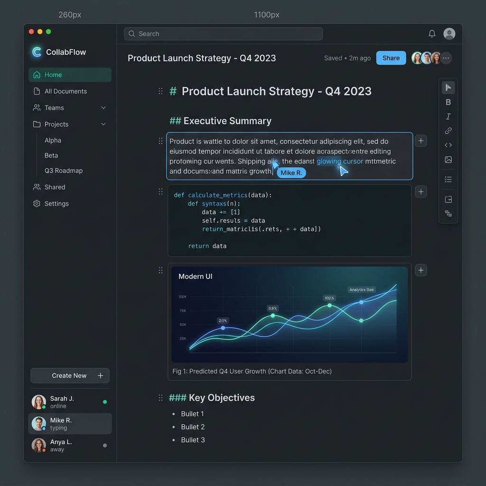

<div align="center">
  
  <br />
  <br />
  <h1>BlockC</h1>
  <p><strong>A Next-Generation Block-Based Collaborative Editing Platform</strong></p>
  
  [](https://opensource.org/licenses/MIT)
  [](http://makeapullrequest.com)
</div>

<br />

## 📖 Overview

**BlockC** is an innovative, block-based collaborative editing workspace designed to empower teams and individuals. Built with modern web technologies, BlockC provides a seamless, robust environment for document creation, content management, and real-time teamwork. 

Whether you're drafting technical documentation, managing project wikis, or organizing personal notes, BlockC's intuitive interface adapts to your workflow.

---

## ✨ Key Features

- **🧱 Block-Based Architecture:** Construct documents using modular blocks (text, code, images, embeds) that can be easily rearranged and styled.
- **⚡ Real-Time Collaboration:** Co-author documents with your team in real-time, featuring live cursor tracking and presence indicators.
- **🔒 Secure Authentication:** Enterprise-grade security with robust user authentication, ensuring your data remains private and secure.
- **📂 Advanced Document Management:** Organize workspaces using nested folders, tags, and powerful search capabilities.
- **📱 Responsive & Accessible:** A meticulously crafted, dynamic UI that delivers a first-class experience across desktops, tablets, and mobile devices.

---

## 🛠️ Technology Stack

BlockC is engineered using a modern, scalable full-stack ecosystem:

### Frontend
- **Framework:** [React 18+](https://reactjs.org/) powered by [Vite](https://vitejs.dev/) for lightning-fast HMR and optimized builds.
- **Styling:** Vanilla CSS / Tailwind CSS for a highly customizable and responsive design system.
- **State Management:** (TBD - e.g., Redux Toolkit, Zustand, or Context API)

### Backend
- **Runtime Environment:** [Node.js](https://nodejs.org/)
- **Framework:** [Express.js](https://expressjs.com/) for scalable API routing.
- **Database:** [MongoDB](https://www.mongodb.com/) (NoSQL document storage optimized for block structures).
- **Authentication:** [Firebase Auth](https://firebase.google.com/docs/auth) / JWT-based custom auth.

---

## 🚀 Getting Started

Follow these instructions to set up the project locally for development and testing.

### Prerequisites

Ensure you have the following installed on your local machine:
- **Node.js** (v18.0.0 or higher recommended)
- **npm** (v9.0.0 or higher)
- **Git**

### Installation & Setup

1. **Clone the repository:**
   ```bash
   git clone https://github.com/Jafsoon1000/blockc.git
   ```

2. **Navigate to the project directory:**
   ```bash
   cd blockc
   ```

3. **Install dependencies:**
   ```bash
   npm install
   ```

4. **Environment Variables:**
   Create a `.env` file in the root directory and configure your environment variables (e.g., Database URI, JWT Secrets, Firebase keys). *Refer to `.env.example` if available.*

### Running the Development Server

To start the frontend and backend development servers concurrently:
```bash
npm run dev
```
The application will be accessible at `http://localhost:5173` (or the port specified by Vite).

---

## 🏗️ Architecture & Roadmap

Our development lifecycle is structured to ensure stability and scalability:
1. **Phase 1: Core Foundation** - UI/UX design system, basic authentication, and block editor implementation.
2. **Phase 2: Data Persistence** - Backend API integration, database schema optimization for document blocks.
3. **Phase 3: Real-Time Sync** - WebSockets integration for live collaboration.
4. **Phase 4: Polish & Deployment** - Performance auditing, CI/CD pipelines, and production release.

---

## 🤝 Contributing

We believe in the power of open-source collaboration! If you'd like to contribute to BlockC:

1. Fork the repository.
2. Create your feature branch (`git checkout -b feature/AmazingFeature`).
3. Commit your changes (`git commit -m 'Add some AmazingFeature'`).
4. Push to the branch (`git push origin feature/AmazingFeature`).
5. Open a Pull Request.

Please ensure your code adheres to the existing style guidelines and passes all tests.

---

## 📄 License

Distributed under the MIT License. See `LICENSE` for more information.

---
<div align="center">
  <sub>Built with ❤️ by the BlockC Development Team.</sub>
</div>
