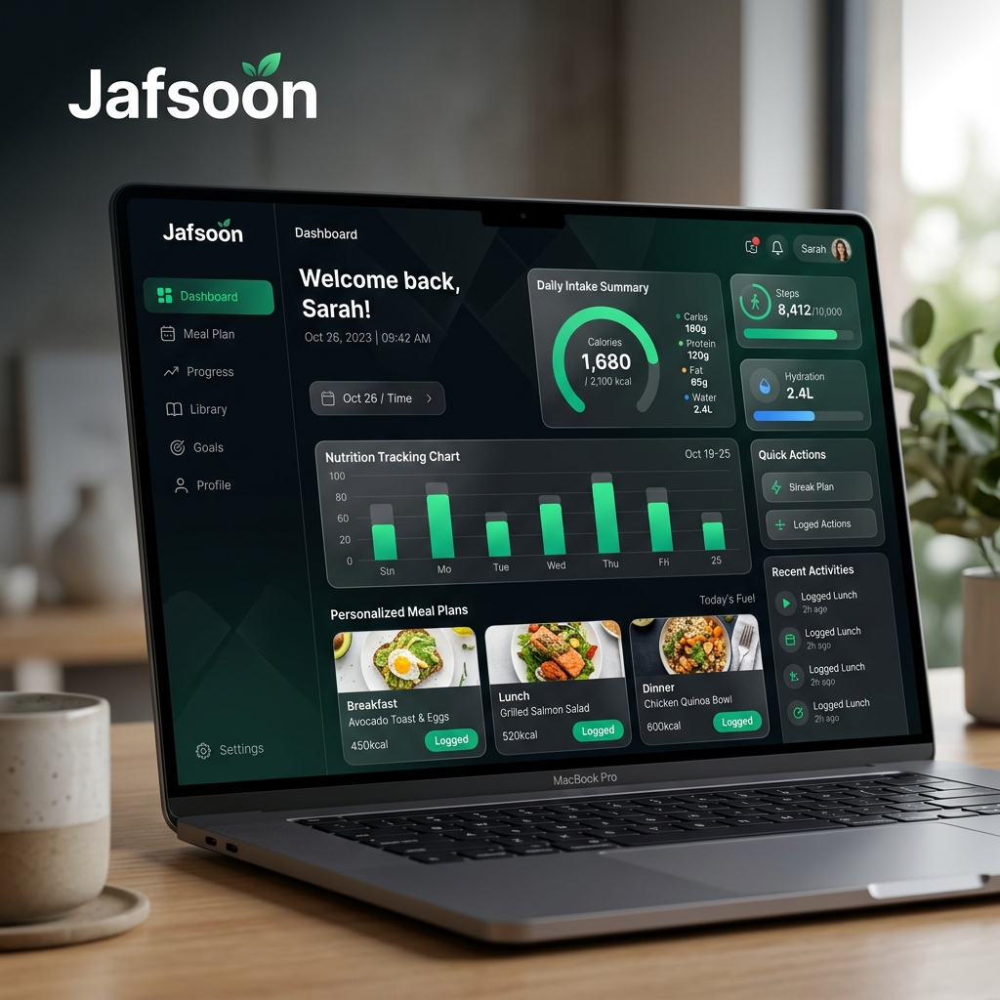

<div align="center">
  
  <br />
  <br />
  <h1>Jafsoon</h1>
  <p><strong>Your Ultimate Personalized Dieting and Nutrition Platform</strong></p>
  
  [](https://opensource.org/licenses/MIT)
  [](http://makeapullrequest.com)
</div>

<br />

## 🥗 Overview

**Jafsoon** is a modern, comprehensive dieting and health tracking application designed to help users achieve their wellness goals. Featuring personalized meal plans, detailed macro tracking, and an intuitive dashboard, Jafsoon makes healthy living accessible and engaging.

Whether your goal is weight loss, muscle gain, or simply maintaining a balanced lifestyle, Jafsoon provides the tools and insights you need to succeed.

---

## ✨ Key Features

- **📊 Comprehensive Nutrition Tracking:** Log meals effortlessly and monitor your daily caloric and macronutrient intake with beautiful visual charts.
- **🥑 Personalized Meal Plans:** Generate tailored dietary recommendations based on your unique health goals and preferences.
- **🔒 Secure Authentication:** Private and secure user profiles to keep your health data protected.
- **📱 Responsive & Accessible:** A fresh, vibrant UI that looks stunning and works perfectly across desktops, tablets, and mobile devices.
- **📈 Progress Monitoring:** Track your weight, body metrics, and overall progress over time.

---

## 🛠️ Technology Stack

Jafsoon is engineered using a modern, scalable full-stack ecosystem:

### Frontend
- **Framework:** [React 18+](https://reactjs.org/) powered by [Vite](https://vitejs.dev/) for lightning-fast HMR and optimized builds.
- **Styling:** Vanilla CSS / Tailwind CSS for a highly customizable and responsive design system.
- **State Management:** Context API / Redux Toolkit

### Backend
- **Runtime Environment:** [Node.js](https://nodejs.org/)
- **Framework:** [Express.js](https://expressjs.com/) for scalable API routing.
- **Database:** [MongoDB](https://www.mongodb.com/) (Ideal for flexible nutrition and user profiles).
- **Authentication:** [Firebase Auth](https://firebase.google.com/docs/auth) / JWT-based custom auth.

---

## 🚀 Getting Started

Follow these instructions to set up the project locally for development and testing.

### Prerequisites

Ensure you have the following installed on your local machine:
- **Node.js** (v18.0.0 or higher recommended)
- **npm** (v9.0.0 or higher)
- **Git**

### Installation & Setup

1. **Clone the repository:**
   ```bash
   git clone https://github.com/Jafsoon1000/jafsoon.git
   ```

2. **Navigate to the project directory:**
   ```bash
   cd jafsoon
   ```

3. **Install dependencies:**
   ```bash
   npm install
   ```

4. **Environment Variables:**
   Create a `.env` file in the root directory and configure your environment variables (e.g., Database URI, JWT Secrets, Firebase keys). *Refer to `.env.example` if available.*

### Running the Development Server

To start the frontend and backend development servers concurrently:
```bash
npm run dev
```
The application will be accessible at `http://localhost:5173` (or the port specified by Vite).

---

## 🤝 Contributing

We welcome contributions to make Jafsoon even better! If you'd like to help:

1. Fork the repository.
2. Create your feature branch (`git checkout -b feature/AmazingFeature`).
3. Commit your changes (`git commit -m 'Add some AmazingFeature'`).
4. Push to the branch (`git push origin feature/AmazingFeature`).
5. Open a Pull Request.

Please ensure your code adheres to the existing style guidelines and passes all tests.

---

## 📄 License

Distributed under the MIT License. See `LICENSE` for more information.

---
<div align="center">
  <sub>Built with ❤️ by Jafsoon.</sub>
</div>
